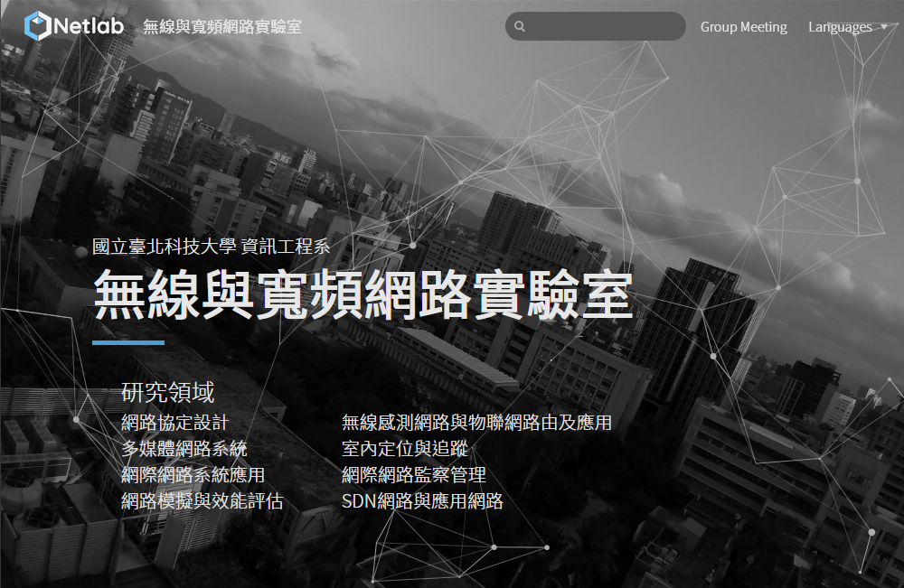
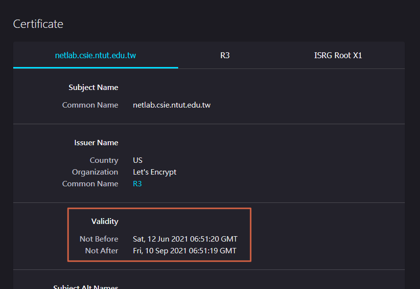

# Netlab 網頁 TLS 憑證更新

教育部規定任何從學術網路對外的網站必須使用 HTTPS，如果是沒有加密的 HTTP 一律阻擋，僅能從校內存取沒用 TLS 加密的網站。

本實驗室網站使用 [Let's Encrypt](https://letsencrypt.org/) 簽發的免費憑證，而 [Let's Encrypt 憑證的效期是 90 天](https://letsencrypt.org/docs/faq/#what-is-the-lifetime-for-let-s-encrypt-certificates-for-how-long-are-they-valid)，也就是說網站維護者必須每 90 天 Renew 一次，不然別人上我們實驗室網站會看到憑證過期的警告，這是非常丟臉的！(因為我常常取笑其他實驗室網站的憑證過期，哈哈)

幸好我使用 pfsense 作為網站的 proxy 兼 Load balancer，所以憑證是掛在 pfsense 上的，而 pfsense 提供 [ACME](https://datatracker.ietf.org/doc/html/rfc8555) 協定去申請憑證，只要在 UI 點一點就好了。

## 操作步驟

1. 登入 pfsense，點選上方選單 **Services** > **HAProxy**，進入 HAProxy 設定頁面

2. 找到 `netlab-web-tls` 那行，點一下綠色勾勾以便將網站的 Proxy 先關閉。因為我們使用的 ACME Challenge Type 為 [TLS-ALPN-01](https://letsencrypt.org/docs/challenge-types/#tls-alpn-01)，會使用 port 443 做驗證，所以佔用這個 port 的服務必須先關閉。

3. 點完綠色勾勾，會出現黃色提示，務必點選 **Apply Changes** 才會套用設定。

4. 點選上方選單 **Services** > **Acme Certificates**

5. 點選 **Issue/Renew** 按鈕，你會看到齒輪在轉，並耐心等待(不要離開頁面)

6. 完成後會跳出綠色的 log，不要以為是綠色的就是成功了，檢查一下 log 最下面有 `Reload success` 才是憑證更新成功。

7. 重新整理頁面，檢查 **Last renewed** 是憑證更新當天的時間

8. 記得把網站的 proxy 開回來，到 **HAProxy** 頁面找到實驗室網站那排，點一下禁止標誌圖示，一樣在跳出的黃色提示點選 **Apply Changes** 以套用設定。

9. 上一下實驗室網站 netlab.csie.ntut.edu.tw，檢查網站功能性，以及憑證的期限是否有延長。

## More details if you wanna dive deep
- [ACME package | pfSense Documentation - Netgate Docs](https://docs.netgate.com/pfsense/en/latest/packages/acme/index.html)
- [What is Transport Layer Security? | TLS protocol | Cloudflare](https://www.cloudflare.com/zh-tw/learning/ssl/transport-layer-security-tls/)
- [RFC 7301 Application-Layer Protocol Negotiation Extension](https://datatracker.ietf.org/doc/html/rfc7301)
- [ACME TLS ALPN Challenge Extension](https://datatracker.ietf.org/doc/html/draft-ietf-acme-tls-alpn)